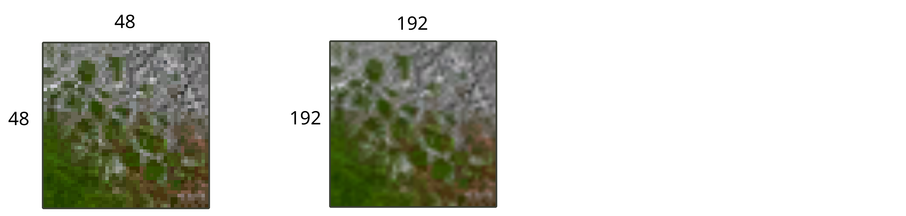
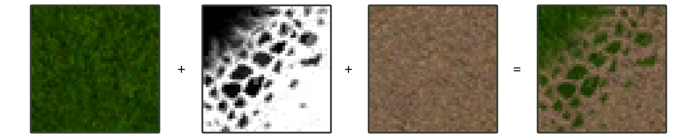
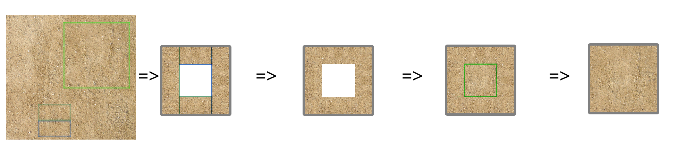
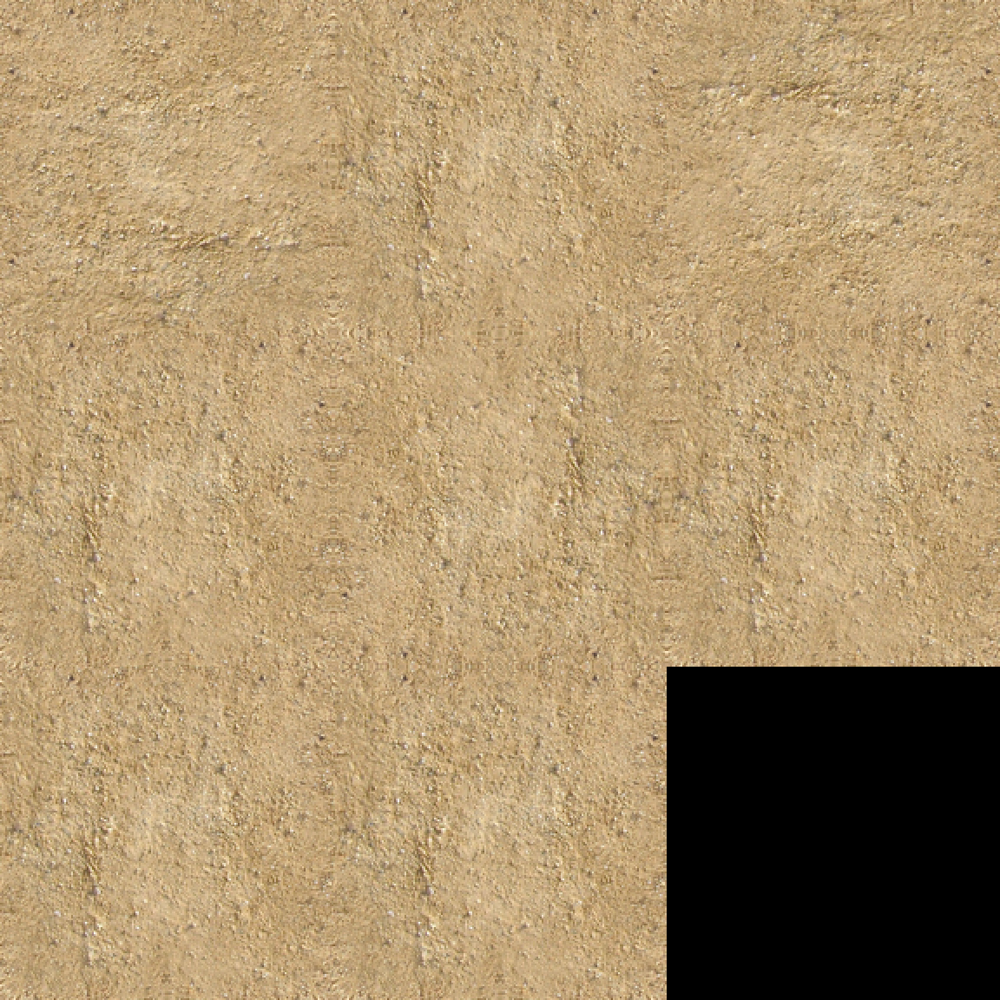

# Создание базовых материалов  
*Предупреждение: данный туториал не претендует на полноту. От читателя ожидается владение графическим редактором с поддержкой слоёв (GIMP, Krita, Photoshop или иным).*

## Что такое базовые материалы  
В «Проклятых Землях» ландшафт раскрашивается (текстурируется) квадратами (тайлами) размером 2х2 метра. Оригинальное разрешение одиночного тайла - 48х48 пикселей. Максимальное разрешение одиночного тайла без модификации движка - 192х192 пикселя.  
Пример оригинального тайла 48х48 и с увеличением до 192х192:  
  
*Примечание: в данном случае изображение 192х192 было получено из 48х48 алгоритмом Митчела. После этого оба изображения приведены к общему размеру с использованием метода «ближайшего соседа».*

Тайлы использовались в силу технических ограничений; в современных 3D играх обычно используются слои, которые смешиваются во время рендеринга кадра игры.  
В «Проклятых Землях» это смешивание было проведено на этапе сборки ресурсов - это позволило ускорить отрисовку.  
То есть изначально художники уровней в специальном редакторе использовали несколько слоёв базовых материалов (камень, трава, песок и т.д.), после чего специальная программа смешивала слои и нарезала на квадратные тайлы. При этом, так как существовало ограничение на общее число тайлов (8 атласов по 8х8 тайлов = 512 тайлов на уровень), производился отброс совпадающих и похожих вариантов, на некоторых уровнях это даже шло в ущерб сохранению плавных переходов между слоями (карта «Портал»).

Технически, маска - это изображение в градациях серого, которое указывает, какую часть интенсивности пикселя использовать из нижнего, а какую - из верхнего из двух смешиваемых слоёв.

Пример смешивания двух базовых материалов с использованием «угловой» маски:  
  
Максимально на тайле может быть до четырёх смешаных базовых материалов, то есть используется до трёх масок.

Базовые материалы оформляются как тайл из одного слоя (то есть базовый тайл не является составным, не содержит смешивания по маскам).  
Базовый тайл должен сохранять бесшовность даже при повороте - то есть, если мы возьмём базовый тайл дважды, то как бы мы не поворачивали эту пару, между ними не должно быть швов. Это требование возникло по двум причинам: так можно избавиться от видимых повторений даже при малом числе базовых тайлов, а также становится возможным вращение «запечённых» тайлов (экономия места в атласах).  
Всего существует 10 вариантов стыковки двух тайлов с одинаковым содержимым. Если подписать стороны как ABCD, то это пары AA, AB, AC, AD, BB, BC, BD, CC, CD, DD.  

В конце 2019 года коммьюнити игры провело частичный разбор уже «запечённых» (смешаных) тайлов на базовые материалы и маски. Это и позволило создать данный туториал и вспомогательные программы для перерисовки текстур ландшафта.

## Создание маски  
### Подготовка  
Перед началом работы определитесь с итоговым разрешением тайлов - оно должно совпадать для тайлов и масок.  
Рекомендуется использовать один из следующих вариантов:  

| Разрешение | Примечание |  
| --- | --- |  
| 48х48 | Оригинальное разрешение тайлов |  
| 96х96 | Удвоенное разрешение, занимает х4 памяти от оригинала |  
| 192х192 | Максимальное поддерживаемое разрешение, х16 памяти от оригинала |  

Для рисования базовых тайлов может пригодится умение создавать бесшовные текстуры в предпочитаемом вами графическом редакторе (GIMP, Photoshop), так как далее будут использоваться типичные приёмы устранения швов при создании бесшовных текстур.

### Выбор исходной текстуры  
Для создания базового тайла в качестве исходного материала не требуется бесшовная текстура, так как предъявляются иные требования к кромке.

В качестве исходного материала рекомендуется использовать фотографии и текстуры, доступные по свободным лицензиям (например, `CC0`). Для поиска можно использовать как поисковые системы (google, yandex), так и специализированные сайты (cc0textures.com, texturehaven.com).

Исходное изображение должно быть без явных теней (имеются в виду направленные тени; можно использовать текстуры с «самозатенением» трещин, неровностей).  
Также исходное изображение не должно иметь явного направления, то есть при повороте на 90, 180, 270 градусов общий вид не должен кардинально меняться (например, однородный песок - хорошо, а уложенная под каким-то одним углом трава - плохо).

Пример хороших и плохих вариантов исходных текстур:  
  
*Примечание: первый вариант содержит направленные тени, второй - явные направления - это помешает получить хорошо стыкующийся базовый тайл. Третье изображение избавлено от этих недостатков.*

### Рисование тайла  
В первую очередь получим полностью стыкуемую рамку. Для этого скопируем часть исходного изображения (область в половину размера стороны создаваемого тайла на примерно четверть).  
Создадим новый файл выбранного разрешения, вставим в два новых слоя, один из которых зеркально отразим относительно короткой стороны - таким образом получим длинную часть, которая будет использоваться как часть рамки. Объединим два слоя и сделаем три копии в новые слои. При этом развернём части рамки одной выбранной стороной наружу.  
Также возможно использовать не одну и ту же сторону четыре раза, а взять область, после чего разрезать её пополам - получим два варианта внешней стороны, которые при этом продолжат стыковаться между собой. То есть, подготовим два варианта частей рамки, следуя предыдущим шагам.  
Подправим области в углах рамки, следя за тем, чтобы не затрагивать самый край. Таким образом, мы получим рамку, которая стыкуется при любом повороте.  
Скопируем и вставим новый кусок из исходного изображения (рекомендуется взять его размером с тайл). Остаётся только исправить переходы между полученной центральной частью и уже имеющейся рамкой, при этом следя за тем, чтобы края оставались незадетыми.

Пример исходного изображения и этапы рисования базового тайла:  
  
*Примечание: была взята текстура песка, откуда были скопированы две смежные области. После вставки частей рамки, их копий с отражением и поворотов полученных граней, были подправлены углы. Далее был добавлен центральный кусок, после чего видимые швы между рамкой и центром были вручную закрашены.*

## Проверка тайла  
Для получения качественного текстурирования ландшафта необходимо убедиться, что тайл:  

1. Имеет бесшовный переход;  
2. Выглядит адекватно при любом повороте.  

Для этого было реализовано отдельное приложение, которое генерирует тестовое изображение со всеми возможными переходами между сторонами тайла.  
Для его использования, перетащите на `check_tile.bat` тайл. При этом в директорию `src` будет записано изображение `tile_checker.png`, которое позволит подробно изучить стыки и общий вид тайла при заполнении им пространства.  
Пример полученного тестового изображения:  
  
*Примечание: на тестовом изображении присутствуют ровно 10 стыков тайла, по одному на каждый из возможных вариантов.  
В данном тестовом изображении явно видна симметрия на стыках - к сожалению, на текстурах из фотографий от этого практически невозможно избавиться, только минимизировать эффект. Единственное решение - рисовать текстуру с нуля (вручную или параметрически).*
