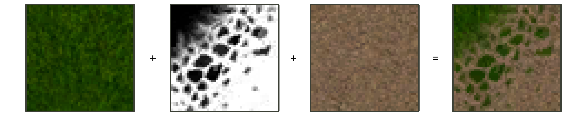

# Создание масок смешивания  
*Предупреждение: данный туториал не претендует на полноту. От читателя ожидается владение графическим редактором с поддержкой слоёв (GIMP, Krita, Photoshop или иным).*

## Что такое маска и для чего она нужна  
В «Проклятых Землях» ландшафт раскрашивается (текстурируется) квадратами (тайлами) размером 2х2 метра. Оригинальное разрешение одиночного тайла - 48х48 пикселей. Максимальное разрешение одиночного тайла без модификации движка - 192х192 пикселя.  
Пример оригинального тайла 48х48 и с увеличением до 192х192:  
  
*Примечание: в данном случае изображение 192х192 было получено из 48х48 алгоритмом Митчела. После этого оба изображения приведены к общему размеру с использованием метода «ближайшего соседа».*

Тайлы использовались в силу технических ограничений; в современных 3D играх обычно используются слои, которые смешиваются во время рендеринга кадра игры.  
В «Проклятых Землях» это смешивание было проведено на этапе сборки ресурсов - это позволило ускорить отрисовку.  
То есть изначально художники уровней в специальном редакторе использовали несколько слоёв материалов (камень, трава, песок и т.д.), после чего специальная программа смешивала слои и нарезала на квадратные тайлы. При этом, так как существовало ограничение на общее число тайлов (8 атласов по 8х8 тайлов = 512 тайлов на уровень), производился отброс совпадающих и похожих вариантов, на некоторых уровнях это даже шло в ущерб сохранению плавных переходов между слоями (карта «Портал»).

Технически, маска - это изображение в градациях серого, которое указывает, какую часть интенсивности пикселя использовать из нижнего, а какую - из верхнего из двух смешиваемых слоёв.  
Пример смешивания двух базовых материалов с использованием «угловой» маски:  
  
Максимально на тайле может быть до четырёх смешаных базовых материалов, то есть, используется до трёх масок.

Всего в игре используется три вида масок, которые могут апроксимировать разные линии перехода. Это «угловая», «диагональная» (внутренний угол), «половинная» маски.  
Пример трёх видов маски одного стиля (угловая, диагональная, половинная, слева направо):  

Две стороны маски (А и Б) всегда стыкуются с маской соседнего тайла (А с Б, Б с А), тогда получается связная линия перехода (А - БА - ... - БА - Б), иногда замкнутая. Всего возможны 9 вариантов перехода для маски одного стиля.  
Все возможные переходы между типами масок:  

В конце 2019 года коммьюнити игры провело частичный разбор уже «запечённых» (смешаных) тайлов на базовые материалы и маски. Это и позволило создать данный туториал и вспомогательные программы для перерисовки текстур ландшафта.

## Создание маски  
### Подготовка  
Перед началом работы определитесь с итоговым разрешением тайлов - оно должно совпадать для тайлов и масок.  
Рекомендуется использовать один из следующих вариантов:  

| Разрешение | Примечание |  
| --- | --- |  
| 48х48 | Оригинальное разрешение тайлов |  
| 96х96 | Удвоенное разрешение, занимает х4 памяти от оригинала |  
| 192х192 | Максимальное поддерживаемое разрешение, х16 памяти от оригинала |  

Для рисования масок может пригодится умение создавать бесшовные текстуры в предпочитаемом вами графическом редакторе (GIMP, Photoshop), так как у маски присутствуют стороны А и Б, которые должны стыковаться между собой. Для этого будут использоваться типичные приёмы создания бесшовных текстур.

### Рисование половинной маски  
В первую очередь, крайне рекомендуется нарисовать половинную маску. Для этого найдите или создайте горизонтальную линию перехода на квадратной текстуре. Желательно, чтобы баланс белого и чёрного был 1:1. При этом верх должен быть абсолютно белый, а низ - абсолютно чёрный.  
После этого необходимо доработать маску, чтобы края стыковались друг с другом. Один из вариантов - использовать инструмент «Сдвиг», переместив изображение на 50% вбок по горизонтали. После этого с помощью «Штампа» или иных инструментов подправить центральную область.  
Пример исходного изображения и этапы рисования маски:  
  
*Примечание: была взята текстура разбрызганной краски, откуда был вырезан кусок. После поворота в горизонтальное положение, были инвертированы цвета и подчищены брызги внизу. Далее текстура была смещена на 50% по горизонтали, после чего видимый шов в центре был вручную закрашен.*

### Рисование угловой маски  
Теперь можно получить угловую маску из половинной. Для этого скопируйте половинную маску дважды, вставив результаты в два разных слоя. Один из слоёв поверните на 90 градусов против часовой стрелки. Мы получили стыкующиеся стороны А и Б.  
После этого необходимо стереть излишки со слоёв, оставив нетронутыми края.  
Далее заполняем область между сторонами А и Б. Для этого можно использовать оригинальную линию перехода. При этом следим, чтобы не были затронуты стороны текстуры.  
После этого подчищаем стыки всех трёх частей.  
Этапы рисования маски:  
  
*Примечание: была взята половинная маска; создан дополнительный слой с поворотом; вырезана середина; добавлена часть текстуры с исходной текстуры краски, обрезана, инвертирована (отмечена красным). После этого нестыкующиеся детали были вручную исправлены.*

### Рисование диагональной маски  
Процесс схож с рисованием угловой маски. Аналогично добавляем два слоя с половинной маской. Однако один слой поворачиваем на 180 градусов, а второй - на 90 градусов по часовой стрелке.  
Стираем излишки со слоёв, оставляя края нетронутыми.  
Теперь необходимо заполнить центральную область между сторонами А и Б, для чего, опять же, можно использовать оригинальную линию перехода, следя за тем, чтобы стороны текстуры не затрагивались.  
После этого подчищаем стыки частей.  
Этапы рисования маски:  
  
*Примечание: была взята половинная маска; создан дополнительный слой с поворотом; вырезана середина; добавлена часть текстуры с исходной текстуры краски, обрезана, инвертирована (отмечена красным). После этого нестыкующиеся детали были вручную исправлены.*

## Проверка масок  
Для получения качественного текстурирования ландшафта необходимо убедиться, что маски:  

1. Имеют бесшовный переход;  
2. Выполнены в общем стиле, без инородно выглядящих элементов.  

Для этого было реализовано отдельное приложение, которое генерирует тестовое изображение со всеми возможными переходами между тремя типами масок.  
Для его использования перетащите на `check_masks.bat` папку с масками, которые должны быть в формате `.png` и названы `corner.png`, `diagonal.png`, `half.png`. При этом в директорию `src` будет записано изображение `mask_checker.png`, которое позволит подробно изучить стыки и общий вид масок.  
Пример полученного тестового изображения:  
  
